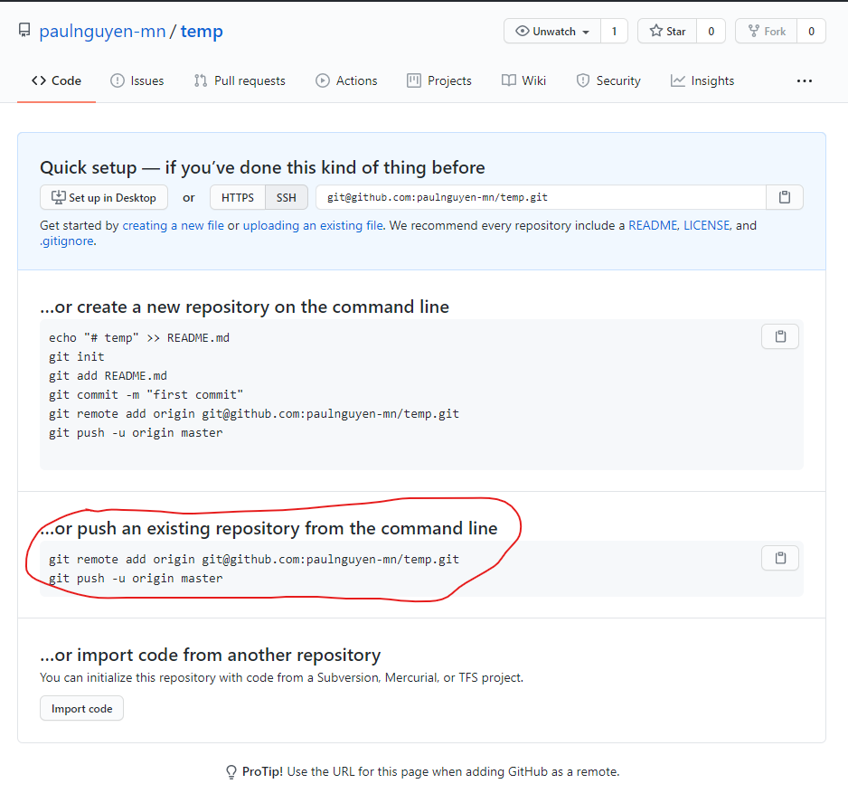
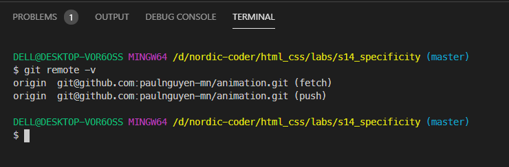
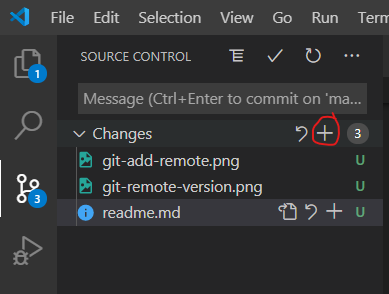
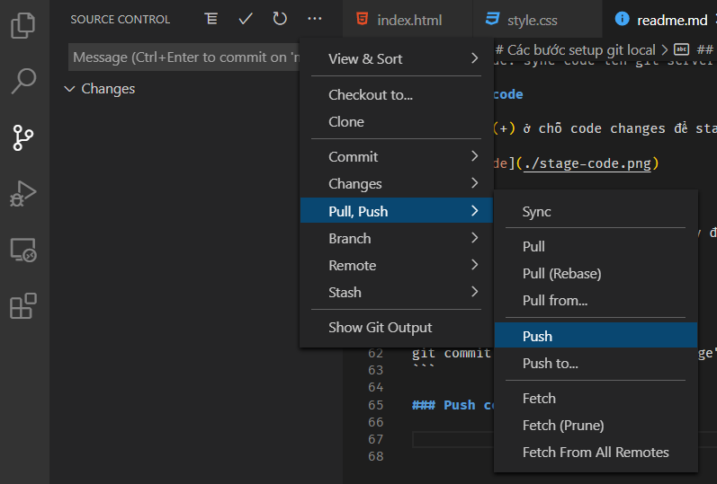

# Các bước setup git local 

## Thiết lập name và email cho git 

Mở terminal lên và chạy 2 lệnh sau

```bash
git config --global user.name "Hau Nguyen"
git config --global user.email "paulnguyen.mn@gmail.com"
```

> Note: Nhớ thay tên và email thành của bạn nhé.

## Khởi tạo Git local cho project của mình 

```bash
git init
```

## Set git mote server cho cái git local

Cái này là để khi push code lên server, nó biết là đẩy lên `repository` nào

Vào github repository của các bạn



Lần lượt copy và paste 2 lệnh được khoanh tròn vào terminal để chạy nhé.

Sau khi hoàn thành, kiểm tra bằng cách chạy lệnh: 

```
git remote -v
```

Thấy nó ra dạng thế này là ngon lành




## Rồi giở đẩy code lên Github 

Mình phải trải qua 3 giai đoạn
1. Stage code: để thêm code changes
2. Commit code: đẩy code vào git local
3. Push code: sync code lên git server

### Stage code 

Click dấu (+) ở chỗ code changes để stage code



### Commit code 

Gõ commit message để mô tả những thay đổi này là gì? Sau đó nhấn `Ctrl + Enter`

<br>
Hoặc chạy lệnh

```
git commit -m "Nội dung commit message"
```

### Push code



hoặc chạy lệnh 

```
git push
```